<div align="center">

# 🧩 Embeddable Widget Platform

**A multi-tenant backend platform for creating embeddable widgets, capturing visitor submissions in real time, and managing everything from a secure owner dashboard.**

Built as the capstone project for the **FlyRank AI — Backend Engineering Internship** (July 2026 cohort)


[Overview](#overview) • [Report](#-full-project-report) • [Architecture](#architecture) • [Features](#features) • [Setup](#getting-started) • [API](#api-endpoints) • [Testing](#testing) • [Screenshots](#screenshots)

</div>

---

## Overview

Any website can drop in a single `<script>` tag to render a widget — a signup form, a promotional popover, or a call-to-action. Every visitor submission is captured, spam-filtered, rate-limited, and geo-enriched in real time, then made available in a secure, owner-only dashboard where the widget's owner can search, filter, edit, delete, and export their data.

The project was built end-to-end: schema design → REST API → auth & security → owner dashboard → automated test suite, matching the exact "Definition of Done" set out in the FlyRank capstone brief (CORS handling, payload validation, rate limiting, geo-provider fallback — all covered by dedicated automated tests).

## Full Project Report

A complete technical report of this project is available as a PDF. It covers system architecture, database design, API structure, security, and testing.

Important: GitHub may not display the PDF correctly. Please download the file to view it.

👉 Download Full Report (PDF):  
docs/capstone-project-report.pdf

## Architecture

<p align="center">
  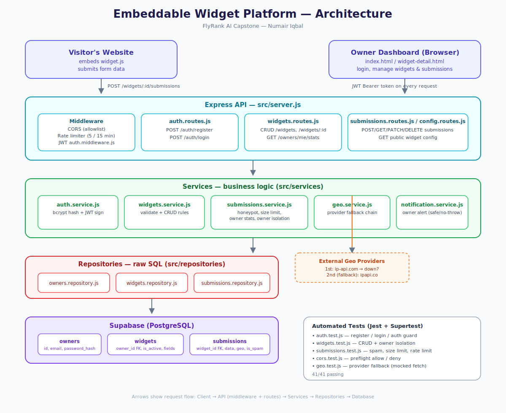
</p>

**Request flow:** Client (visitor's site or owner's dashboard) → Express API (CORS allowlist, rate limiting, JWT auth) → Services (validation & business rules) → Repositories (parameterized SQL) → Supabase PostgreSQL.

## Features

| | |
|---|---|
| 🔐 **JWT Authentication** | bcrypt-hashed passwords, signed tokens, protected routes via middleware |
| 🏢 **Multi-tenant Widgets** | Full CRUD, every widget scoped to its owner (`owner_id`), tenant isolation enforced at the repository layer — verified by dedicated isolation tests |
| 🌐 **Public Embed Script** | Lightweight `widget.js` that renders the widget on any third-party site and posts submissions — no auth required from the visitor |
| 🛡️ **Spam & Abuse Protection** | Honeypot field detection, payload size limits, and per-IP rate limiting (5 requests / 15 min) on the public submission endpoint |
| 🌍 **Geo Enrichment with Fallback** | Every submission is enriched with visitor country/city via a primary provider (ip-api.com), automatically falling back to a secondary provider (ipapi.co) if the first is unavailable — degrades gracefully (no crash) if both fail |
| 📊 **Owner Dashboard** | Live stats, clickable widget filters, a searchable/filterable/exportable submissions table, and full Add/Edit/Delete flows |
| 🌐 **CORS Allowlisting** | Only explicitly permitted origins can call the API |
| ✅ **41 Automated Tests** | Auth, CRUD, owner isolation, spam detection, rate limiting, CORS preflight, and geo-fallback — all covered |

## Tech Stack

| Layer | Technology |
|---|---|
| Backend | Node.js, Express 5 |
| Database | PostgreSQL (Supabase) |
| Auth | JWT (`jsonwebtoken`), `bcrypt` |
| Rate Limiting | `express-rate-limit` |
| Testing | Jest, Supertest |
| API Documentation | Postman |
| Frontend | Vanilla HTML / CSS / JavaScript |

## Project Structure

```
src/
  config/              # database connection (db.js), schema.sql
  middleware/           # JWT auth middleware
  repositories/          # raw SQL — owners, widgets, submissions
  services/               # business logic — auth, widgets, submissions, geo, notifications
  routes/                 # Express route definitions
  public/dashboard/        # login.html, index.html, widget-detail.html, widget.js
  __tests__/                # Jest test suites (auth, widgets, submissions, cors, geo)
docs/
  capstone-project-report.pdf  # full written project report
  architecture-diagram.svg     # system architecture diagram
  api-collection.postman_collection.json
server.js
```

## Getting Started

### Prerequisites
- Node.js 18+
- A PostgreSQL database (this project uses [Supabase](https://supabase.com))

### Setup

```bash
git clone <your-repo-url>
cd embeddable-widget-platform
npm install
```

Create a `.env` file in the project root:

```dotenv
PORT=3000
DATABASE_URL=your_postgres_connection_string
JWT_SECRET=your_jwt_secret
```

Run `src/config/schema.sql` against your database (Supabase SQL Editor, or `psql`) to create the `owners`, `widgets`, and `submissions` tables.

### Run the server

```bash
npm start        # production
npm run dev        # development, with nodemon auto-restart
```

The API runs at `http://localhost:3000`. The dashboard is served at `http://localhost:3000/dashboard/login.html`.

### Run the tests

Create a `.env.test` file with a database connection string (each test file creates and cleans up its own uniquely-named data, so it never touches real records):

```dotenv
PORT=3000
DATABASE_URL=your_postgres_connection_string
JWT_SECRET=your_jwt_secret
```

```bash
npm test
```

## API Endpoints

| Method | Endpoint | Auth | Description |
|---|---|---|---|
| POST | `/auth/register` | — | Create an owner account |
| POST | `/auth/login` | — | Log in, receive a JWT |
| POST | `/widgets` | ✅ | Create a widget |
| GET | `/widgets` | ✅ | List the owner's widgets |
| GET | `/widgets/:id` | ✅ | Get one widget (owner-only) |
| PUT | `/widgets/:id` | ✅ | Update a widget |
| DELETE | `/widgets/:id` | ✅ | Delete a widget |
| GET | `/owners/me/stats` | ✅ | Dashboard stats (totals, active count) |
| GET | `/widgets/:id/config` | — | Public widget config, used by `widget.js` |
| POST | `/widgets/:id/submissions` | — | Public — visitor submits the form (rate-limited) |
| GET | `/widgets/:id/submissions` | ✅ | List submissions for a widget |
| PATCH | `/widgets/:id/submissions/:subId` | ✅ | Edit a submission |
| DELETE | `/widgets/:id/submissions/:subId` | ✅ | Delete a submission |

## Testing

**41 automated tests across 5 suites**, written with Jest + Supertest, matching the exact Definition-of-Done requirements: CORS preflight handling, payload validation, rate-limiter triggering, and geo-provider fallback.

| Suite | Tests | Covers |
|---|---|---|
| `auth.test.js` | 9 | Register, login, duplicate-email rejection, protected-route access |
| `widgets.test.js` | 11 | Widget CRUD, **owner isolation** |
| `submissions.test.js` | 12 | Honeypot spam detection, invalid/oversized payload rejection, valid submission flow, **rate limiting**, Edit/Delete with owner isolation |
| `cors.test.js` | 3 | Preflight requests from allowed / disallowed origins |
| `geo.test.js` | 5 | Provider fallback chain — mocked, deterministic, no real network calls |

```
Test Suites: 5 passed, 5 total
Tests:       41 passed, 41 total
```

<p align="center">
  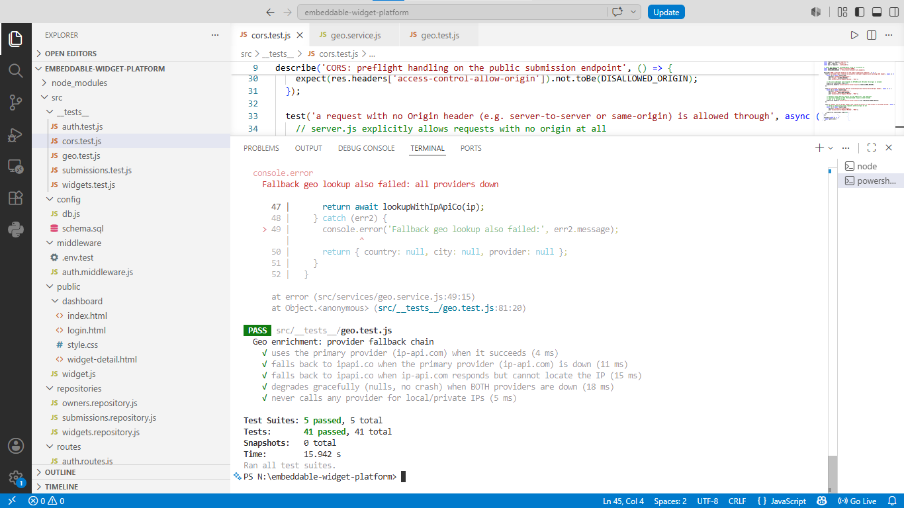
</p>

## API Documentation (Postman)

The full API is documented and testable via a Postman collection (`docs/api-collection.postman_collection.json`), organized into **Auth**, **Widgets**, and **Submissions** folders, with example responses recorded for each request:


| Request | Result |
|---|---|
| ✅ `POST /register` | `201 Created` — password hashed with bcrypt before storage |
| ✅ `POST /login` | `200 OK` — returns a signed JWT for authenticating future requests |
| 🔒 `GET /profile` (with token) | `200 OK` — authorized |
| 🔒 `GET /profile` (no/invalid token) | `401 Unauthorized` — blocked |

## Database Schema

Three tables — `owners`, `widgets`, `submissions` — linked by `owner_id` and `widget_id` foreign keys that enforce tenant isolation at the database level, with indexes on the columns used for lookups and sorting.

<table>
<tr>
<td align="center">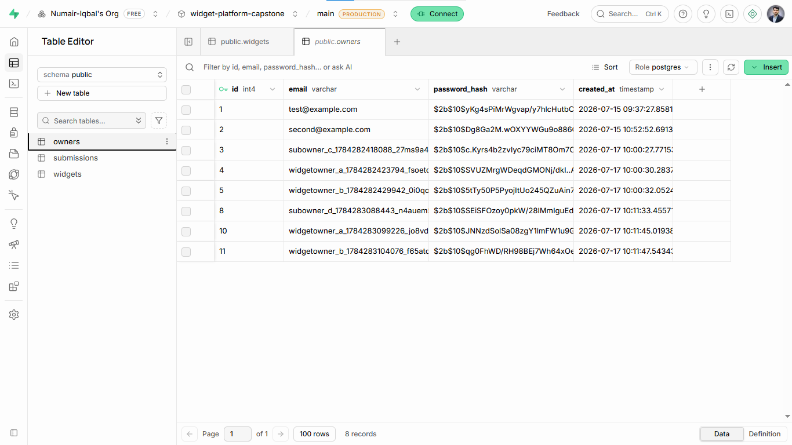<br><sub><b>owners</b></sub></td>
<td align="center">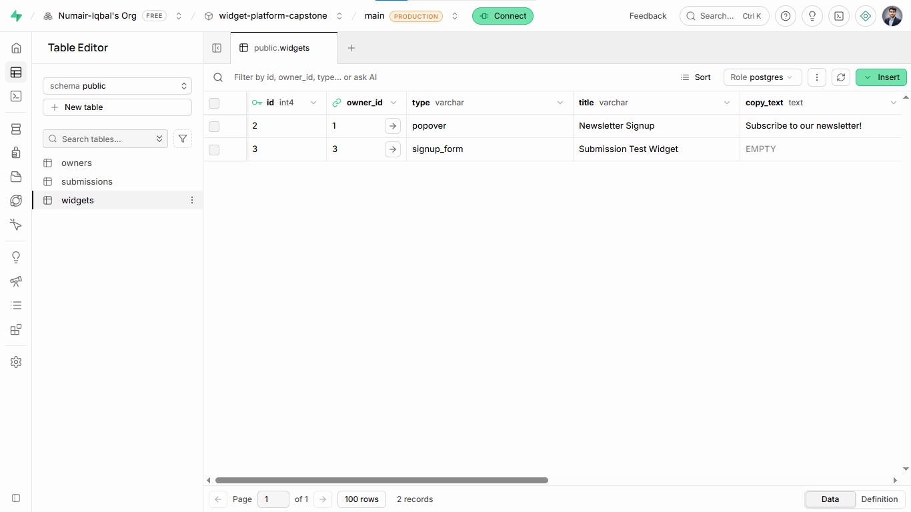<br><sub><b>widgets</b></sub></td>
<td align="center">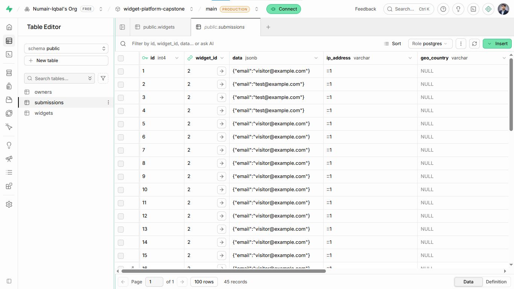<br><sub><b>submissions</b></sub></td>
</tr>
</table>

## Screenshots

<table>
<tr>
<td align="center">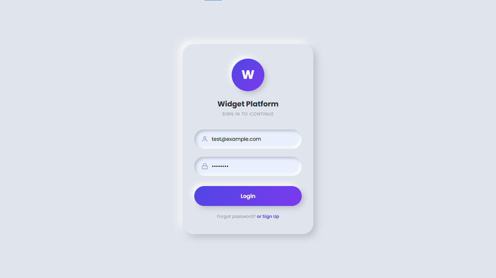<br><sub><b>Login</b></sub></td>
<td align="center">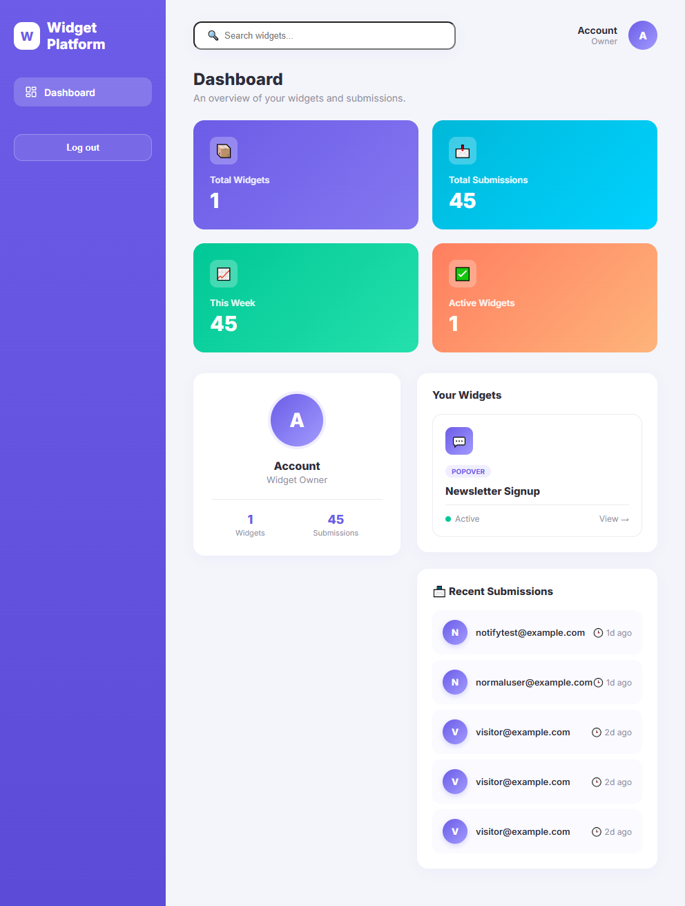<br><sub><b>Dashboard</b></sub></td>
<td align="center">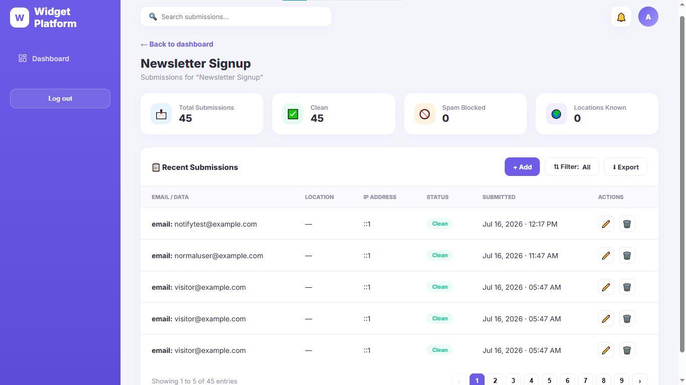<br><sub><b>Widget Submissions</b></sub></td>
</tr>
<tr>
<td align="center">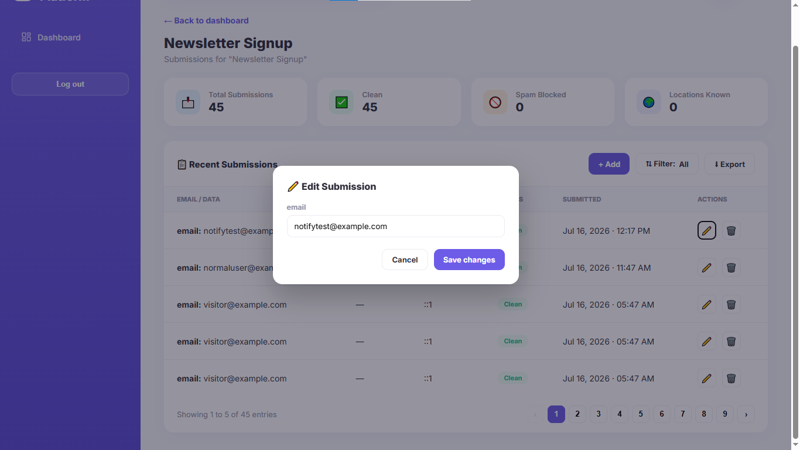<br><sub><b>Edit Submission</b></sub></td>
<td align="center">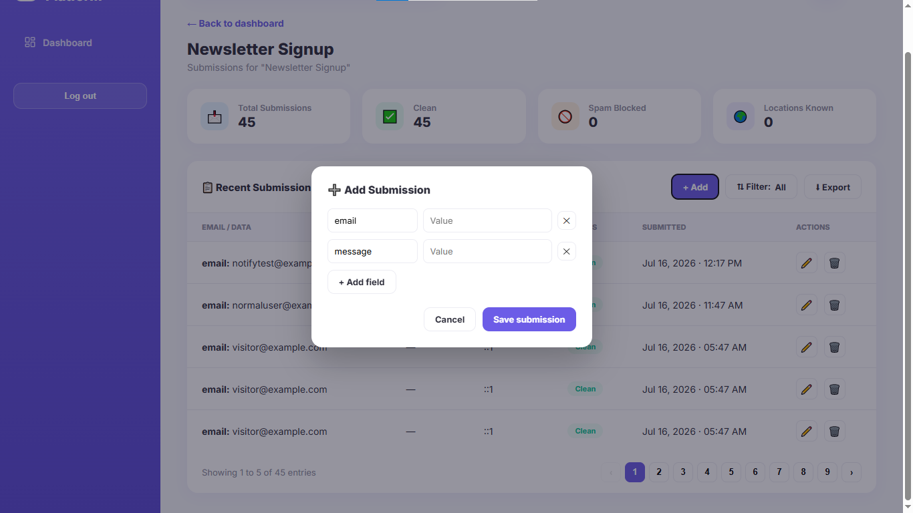<br><sub><b>Add Submission</b></sub></td>
<td></td>
</tr>
</table>

## Live Embed Demo Walkthrough

An end-to-end walkthrough of the public embed script — from a visitor's view on a third-party page, through to the owner seeing the result in their dashboard and managing it.

| Step | Screenshot |
|---|---|
| 1️⃣ Widget rendered live via `widget.js` on a demo page | 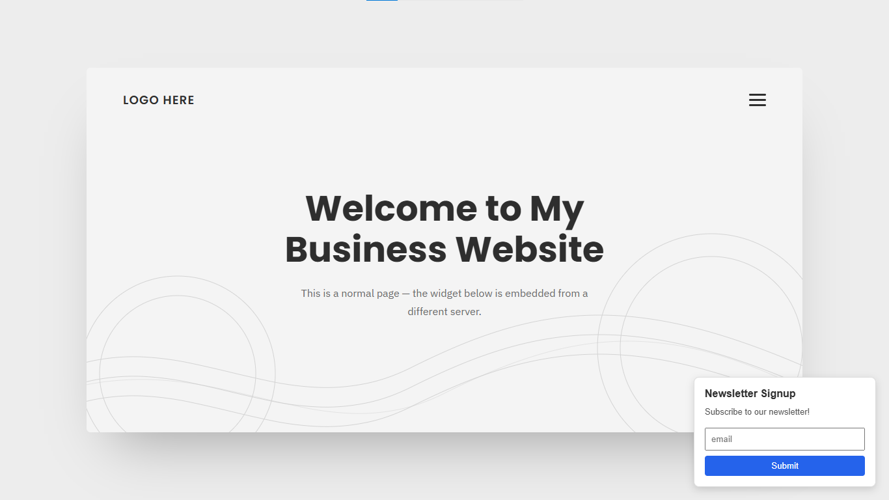 |
| 2️⃣ Visitor fills out the form | 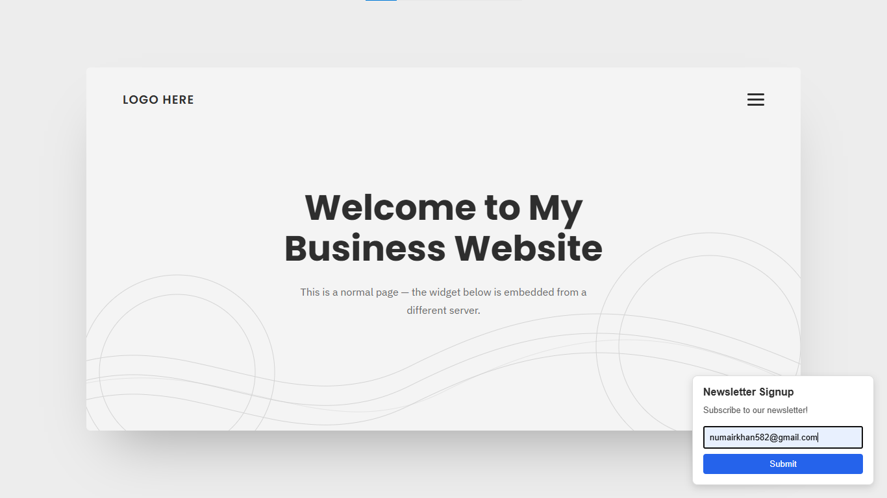 |
| 3️⃣ Visitor submits | 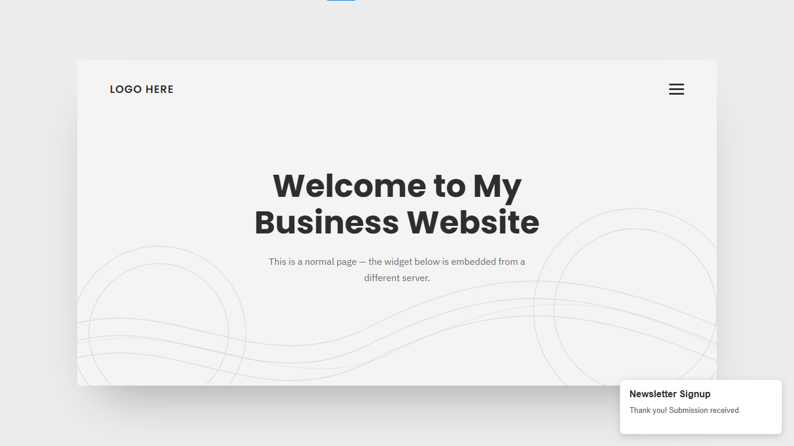 |
| 4️⃣ Submission instantly visible in the owner's dashboard | 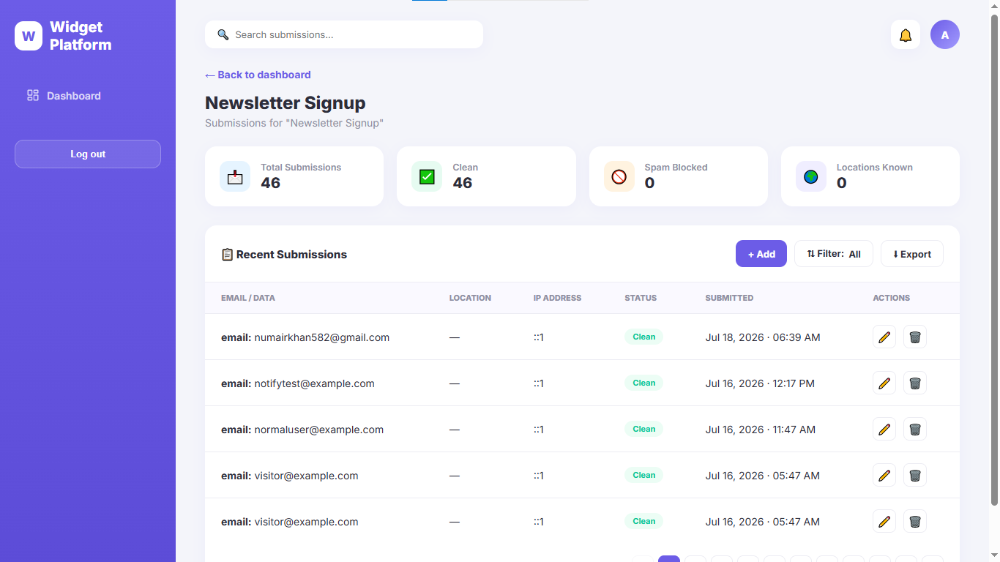 |
| 5️⃣ Owner deletes a submission (with confirmation) | 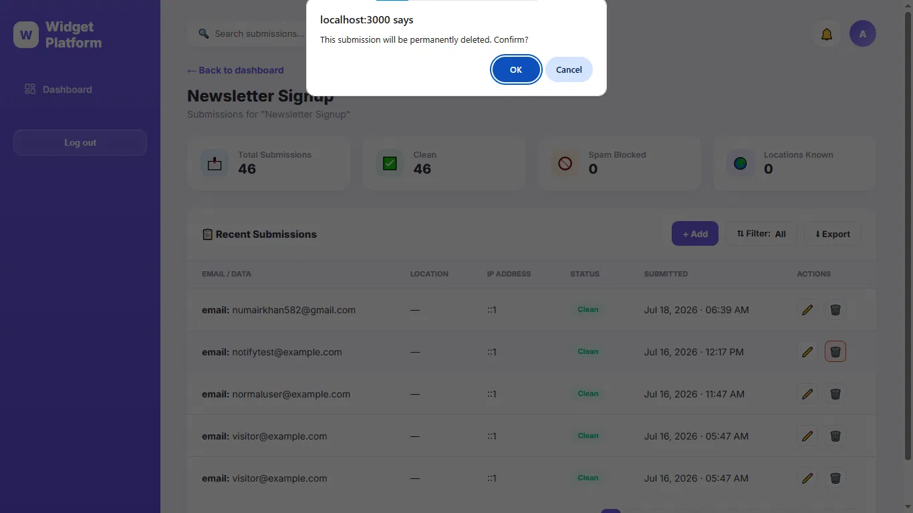 |
| 6️⃣ List updates immediately after deletion | 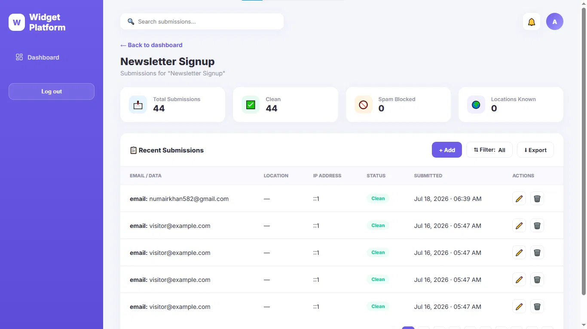 |

---

<div align="center">

## Author

**Numair Iqbal**
Backend AI Engineering Intern, FlyRank AI (July 2026 cohort)
BS Computer Science — University of Layyah

[](https://github.com/Numair-Iqbal)
[](https://linkedin.com/in/numair-iqbal)

</div>
